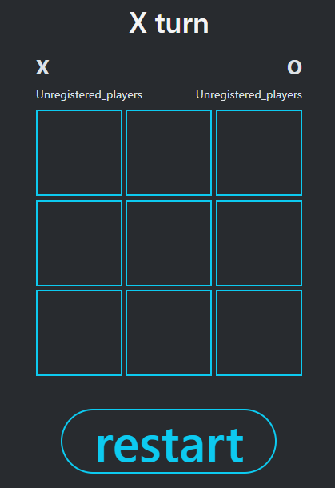
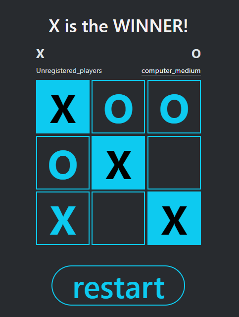
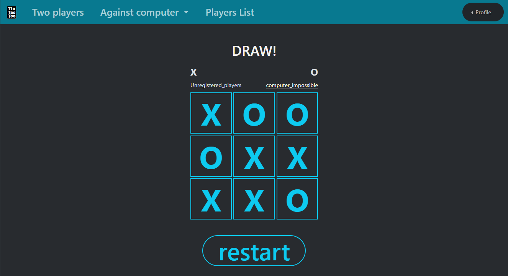
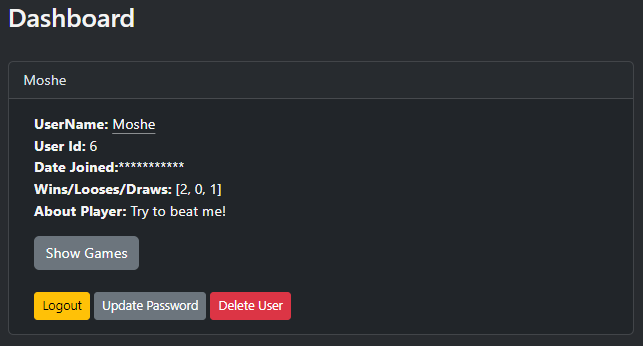
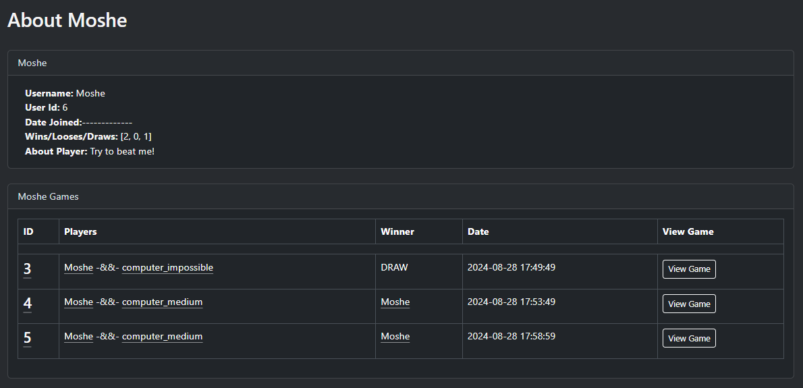
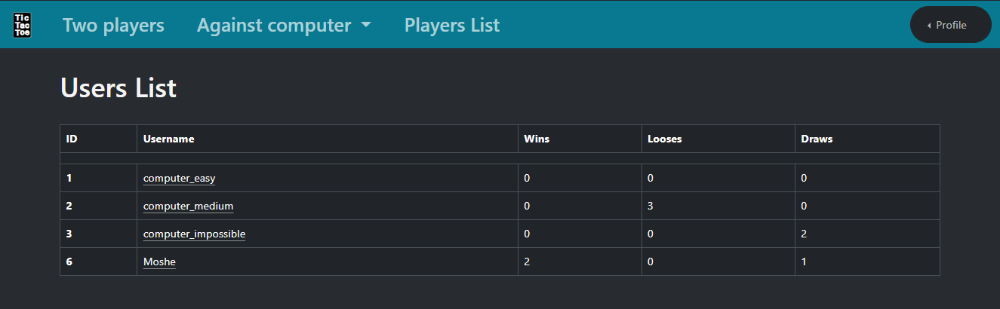
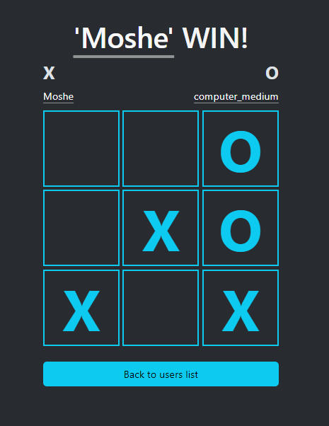
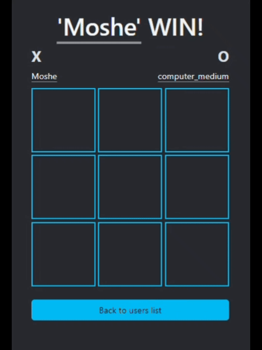

# TIC TAC TOE
A web application that allows you to play Tic Tac Toe.

## Gameplay
Tic-tac-toe is played on a three-by-three grid by two players, who alternately place the marks X and O in one of the nine spaces in the grid.
Each player in turn marks a mark in one of the squares, the winning player is the one who managed to fill a row, column or diagonal with his marks. If no player has managed to do this until all the squares are full, the game ends in a draw.

## Installation
1. Clone repository(Or download in ZIP file).
```
git clone https://github.com/Moshe-f/tic_tac_toe.git
```

2. Install dependencies.
 (playwright and pytest, they are optional and intended for testing)
```
pip install -r requirements.txt
```

3. Preparation.
   1. Set environment variable for Flask SECRET_KEY
      `TIC_TAC_TOE_SECRET_KEY`

   2. Set environment variable key with URL for postgresql
      `TIC_TAC_TOE_POSTGRES_URL`

      Or run Postgres DB on localhost with user postgres

      Set environment variable key for `POSTGRES_PASSWORD`

Run the create db file to create the db, table, player etc.
```
python tic_tac_toe/create_db.py
```

4. Play!
```
python tic_tac_toe/app.py
```

The server supposed to run on http://127.0.0.1:5000


## OR Just enter to online web app😀.
Live on [Tic-Tac-Toe in render](https://tic-tac-toe-dnbe.onrender.com/)(The request can delay for 50 seconds or more-because of free plan😔, If error code 500 appears it is probably because the DB is not working properly try another time😥)

---

## Description
You can register for the website just with username and password(password is encrypted with scrypt)

Or you can play as an unregistered player.

You can play two people one against the other,

Or you can play against the computer in 3 modes
- easy
- medium
- impossible

The site has a list of registered players.
And all game history played.

You can watch history games live again (runs with JS) each move separately.

Each player has an about page as well as a dashboard.

Players can change their password and delete their user(all games in their history will change to unregistered player).

The app was built using Python and FLASK library
(a little HTML, CSS and JS)

The app uses PostgreSQL as a DB for data storage

And SQLAlchemy to communicate with the DB

### Tests

The game has 97% coverage in tests with PYTEST(and UI test with Playwright)

To run tests for the app, you need to install pytest and playwright.

you need to run `playwright install`

you need to run the app server, and run
```
python -m pytest
```

---

### images:
#### start of the game



#### Player win



#### Draw



#### User dashboard



#### User about page



#### Users list



#### View game history



#### View game history in 'live game'




The site and the DB run on RENDER
Live on [Tic-Tac-Toe in render](https://tic-tac-toe-dnbe.onrender.com/) 
(The request can delay for 50 seconds or more-because of free plan😔, 
If error code 500 appears it is probably because the DB is not working properly, try another time😥)
